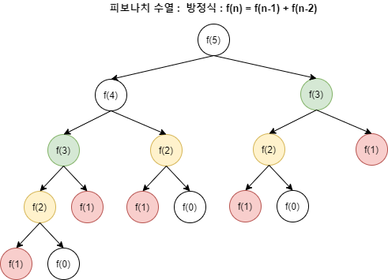
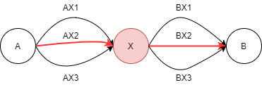

## 동적 계획법, 다이나믹 프로그래밍(Dynamic Programming)이란?

---

동적 계획법은 기본적인 아이디어로 하나의 큰 문제를 여러 개의 작은 문제로 나눠서 그 결과를 저장하여 해결한다.

### 동적 계획법을 사용하는 이유

동적 계획법은 일반적인 재귀 함수 방식과 매우 유사하다.

- 큰 차이점은 일반적인 재귀 사용 시 동일한 문제들이 여러 번 반복되어 비효율적인 계산이 될 수 있다.

예를 들어, 피보나치 수열을 살펴보면 1, 1, 2, 3, 5, 8, 13, 21, 34, 55, 89, 144, … 와 같은 형식이다.

피보나치 수를 구할 때 재귀 함수로 F(N) = F(N-1) + F(N-2)로 구성하면 된다.

- 하지만, F(N-1)과 F(N-2)에서 각 함수를 한 번씩 호출하면 동일한 값이 두 번씩 구해지게 된다.
- 때문에, 100번째 피보나치 수를 구하기 위해서는 호출되는 함수의 회수가 기하급수적으로 증가하게 된다.

그러나 한 번 구한 작은 문제의 결과 값을 저장하고 재사용한다면 앞서 계산된 값을 다시 반복해 구할 필요가 없다.

- 즉, 매우 효율적으로 문제를 해결할 수 있게 되며, 시간복잡도는 O(N^2)에서 O(F(N))으로 개선된다.

## 동적 계획법의 사용 조건

---

동적 계획법을 적용하기 위해서는 다음과 같은 두 가지 조건을 만족해야 한다.

- 겹치는 부분 문제, Overlaping Subproblems
- 최적 부분 구조, Optimal Substructure

### 겹치는 부분 문제, Overlaping Subproblems

동적 계획법은 기본적으로 문제를 나누고 그 문제의 결과값을 재활용해서 전체 답을 구한다.

- 때문에 동일한 작은 문제들이 반복하여 나타나는 경우 사용이 가능하다.

즉, 동적 계획법은 부분 문제의 결과를 저장하여 다시 계산하지 않아야 한다.

- 하지만 부분 문제가 반복적으로 나타나지 않으면 재사용이 불가하므로 문제가 중복되지 않으면 안된다.

예를 들어, 이진 탐색과 피보나치 수열의 경우를 비교해보자.

- 이진 탐색은 특정 데이터가 정렬된 상태에서 위치를 찾아 반환하며, 이를 재사용하지 않는다.
- 반면, 피보나치 수열은 아래와 같은 트리 구조로 함수가 호출되게 된다.

- 위 그림과 같이 F(3), F(2), F(1)과 같은 동일한 부분 문제가 중복되어 나타나는 것을 확인할 수 있다.
- 때문에 앞서 계산한 값을 저장하여 재활용할 수 있게 된다.

### 최적 부분 구조, Optimal Substructure

최적 부분 구조 조건은 부분 문제의 최적 결과값을 사용하여 전체 문제의 최적 결과를 낼 수 있는 경우를 의미한다.

- 때문에 특정 문제의 정답은 문제의 크기에 상관없이 항상 동일하다.

예를 들어, A → B 까지의 가장 짧은 경로를 찾는 문제가 있다고 가정하자.

- 중간에는 X가 존재하며 A → X / X → B 경로 중 가장 짧은 경로라면 전체 최적 경로도 A → X → B 이다.

위 그림처럼 A → X 사이의 최단 거리는 AX2이고, X → B 사이의 최단 거리는 BX2 이다.

- 즉, 전체 최단 거리는 AX2 → BX2 가 된다.
- 만약, 다른 경로를 택한다고 하더라도 전체 최단 경로가 변할 수는 없다.

동적 계획법은 부분 문제에서 구한 최적 결과가 전체 문제에서 동일하게 적용되어 결과가 변하지 않을 때 사용한다.

## 동적 계획법 사용 방법

---

동적 계획법은 특정 경우에 사용하는 것이 아닌, 하나의 방법론으로 다양한 문제 해결에 사용된다.

- 일반적으로 동적 계획법을 사용하기 전에는 다음과 같은 과정을 거쳐서 진행할 수 있다.

### 동적 계획법으로 풀 수 있는 문제인지 확인

현재 직면한 문제가 작은 문제들로 이루어진 하나의 함수로 표현될 수 있는지를 판단해야 한다.

- 즉, 조건들이 충족되는 문제인지를 한 번 체크해보는 것이 좋다.

보통 특정 데이터 내 최대화 및 최소화를 하거나 데이터를 세거나 확률 등의 계산을 할 때 적절하다.

### 문제의 변수 파악

동적 계획법은 현재 변수에 따라 그 결과 값을 찾고 이를 전달하여 재사용하는 과정을 거친다.

- 즉, 문제 내 변수의 개수를 알아내야 한다.

예를 들어, 피보나치 수열에서 N번째 수를 구하는 것으로 N이 변수가 된다.

- 해당 변수가 어느정도냐에 따라 결과 값이 다르지만 그 결과를 재사용하게 된다.

### 변수 간 관계식 만들기, 점화식

변수들에 의해 결과 값이 달라지지만, 동일한 변수 값인 경우에는 결과가 동일하다.

- 또한 해당 결과 값을 그대로 이용하여 관계식을 만들어 낼 수 있다.
- 이를 점화식이라고 부르며, 이를 통해 짧은 코드 내에서 반복 및 재귀로 문제를 자동으로 해결할 수 있다.

### 메모하기, Memoization Or Tabulation

변수 간 관계식까지 정상적으로 구축이 되었다면, 변수의 값에 따른 결과를 저장해야 한다.

- 이를 메모한다고 하여 메모이제이션, Memoization이라고 부른다.

메모이제이션은 변수 값에 따른 결과를 저장할 배열을 미리 만들고 결과가 나올 때마다 배열에 저장 및 재사용한다.

- 해당 결과 값을 저장할 때는 보통 배열을 사용하며, 변수 개수에 따라 배열의 차원이 다양할 수 있다.

## 동적 계획법 구현

---

### Bottom-Up 방식

Bottom-Up 방식은 아래에서부터 계산을 수행하고 누적시켜서 전체의 큰 문제를 해결하는 방식이다.

- Bottom-Up 방식은 Tabulation 방식으로 반복문을 사용하여 구현하는 방식이다.

예를 들어, 메모를 위해 dp라는 배열을 생성하고 이를 1차원 배열이라고 가정하자.

- dp[0]가 기저 상태이고, dp[N]을 목표 상태라고 가정하자.

Bottom-Up 방식은 dp[0]부터 시작하여 반복문을 통해 점화식으로 결과를 내 dp[N]까지 값을 전이시킨다.

Bottom-Up 방식을 Tabulation이라고 부르는 이유는 반복을 통해 dp[0]부터 하나씩 채우는 과정을 의미한다.

- table-filling이라고도 하며, 테이블에 저장된 값에 직접 접근하여 재활용하기 때문이라고 한다.

### Top-Down 방식

Top-Down 방식은 dp[N]의 값을 찾기 위해 위에서부터 호출을 시작해 dp[0]까지 내려가 재귀로 전이시킨다.

- 즉, 결과 값을 재귀 함수를 호출해서 전이시켜 재활용하는 방식이다.

예를 들어, 피보나치처럼 F(N) = F(N-1) + F(N-2)의 과정에서 N=5일 때 F(3)과 F(2)의 동일 계산이 나온다.

- 이때, 이미 이전에 계산된 값을 메모리에 저장되었고, 이를 꺼내서 활용하는 것이다.
- 때문에 가장 최근의 상태 값을 메모해두었다고 하여 Memoization이라고 부른다.

## 참고 자료

- [알고리즘 - Dynamic Programming(동적 계획법)](https://hongjw1938.tistory.com/47)
