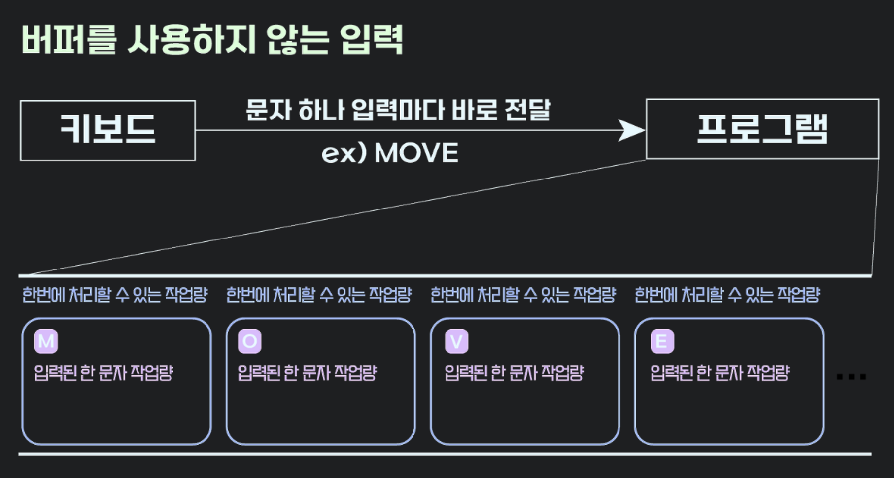

## Buffer 란?

---

버퍼의 단어 뜻을 살펴보면, 완충제 혹은 완화하다라는 의미를 가지고 있다.

즉, 버퍼는 두 개의 장치 사이에서 데이터를 전송할 때 데이터의 전송 속도나 처리 속도 차이를 완화하는 목적이다.

## 버퍼의 동작

---

### 비디오 스트리밍에서의 버퍼 동작

버퍼를 쉽게 말하면, 임시 저장 공간이라는 의미로 비디오 스트리밍에서 버퍼의 동작을 확인해면 다음과 같다.

영상 스트리밍이란 서버에서 영상 파일을 여러 조각으로 나눠 연속적으로 데이터를 보내는 것을 의미한다.

- 여기서 버퍼는 서버로부터 보내지는 영상 파일 데이터들을 순서대로 쌓는 임시 데이터 공간이다.

그림에서 볼 수 있듯이, 동영상을 볼 때 하단 재생바에 표시된 부분이 버퍼를 나타낸다.

즉, 사용자가 영상을 클릭한 순간 서버로부터 여러 조각으로 나뉜 영상 파일이 순서대로 버퍼에 쌓인다.

- 쌓여진 데이터만큼 사용자는 시청을 할 수 있고, 사용자는 영상을 클릭과 동시에 시청할 수 있게 된다.
- 또한, 버퍼에는 데이터가 계속해서 쌓이기 때문에 사용자는 끊김 없이 영상을 시청할 수 있게 된다.

### 입출력에서의 버퍼 동작

예를 들어, 사용자가 프로그램 사용 중 키보드를 통해 MOVE라는 단어를 타이핑했다고 가정해보자.

1. 버퍼가 없는 경우에 키보드로 M, O, V, E를 칠 때마다 프로그램으로 해당 입력이 전달된다.

이때, 프로그램 내 작업 과정은 각 단어가 하나의 작업이고, 각 사각형 크기가 한 번에 처리할 수 있는 작업량이다.

1. 버퍼를 이용하지 않는 경우, 사용자가 키보드를 한 번씩 누를 때마다 각 문자가 프로그램으로 바로 전달되어 문자마다 각각 하나의 작업으로 잡히게 된다.

이때, 프로그램이 한 번에 처리할 수 있는 작업량보다 입력된 하나의 문자를 처리하는 작업량 크기는 매우 작다.

1. 때문에 매 작업마다 불필요한 작업량이 남게 되고, 그만큼의 기회비용도 날아가게 된다.
2. 결국, 속도적인 측면이나 효율적인 측면에서 떨어지게 된다는 것을 알 수 있다.

반면, 버퍼를 사용했을 때의 입력을 들어왔을 때 앞선 예시와 동일한 상황을 가정해보자.

1. 버퍼가 있는 경우, 특정 문자나 행동이 들어올 때까지 사용자가 입력한 문자를 차례대로 저장한다.
    - 여기서 특정 문자나 행동은 엔터나 스페이스 또는 버튼 클릭 등의 이벤트를 의미한다.
2. 엔터나 스페이스와 같은 버퍼의 끝을 알리는 동작이 입력되면 버퍼에 저장된 문자를 프로그램으로 보낸다.

이때, 프로그램에서는 버퍼를 통해 들어온 “MOVE”라는 문자를 하나의 작업으로 잡게 된다.

- 물론, “MOVE”라는 단어도 일반적으로 프로그램이 한 번에 처리할 수 있는 작업량에 비하면 매우 작다.
- 하지만, 사용자가 입력한 문자 전체를 한 번에 처리하므로 날라가는 기회비용은 적다.
1. 결국, 속도적인 측면이나 효율적인 측면에서 버퍼를 사용하는 것이 좋다는 것을 알 수 있다.

## BufferedReader & BufferedWriter 란?

---

간단하게 말하면, BufferedReader와 BufferedWriter는 버퍼를 이용하여 데이터를 입출력을 다루는 함수이다.

- 버퍼는 입출력이 있을 때마다 데이터를 차례대로 모아두었다가 특정 값이 들어오면 한 번에 전송한다.

때문에, BufferedReader와 BufferedWriter는 버퍼를 이용해 속도적인 측면에서 월등히 빠르다는 장점이 있다.

## BufferedReader & Scanner 란?

---

### Scanner의 정의 및 특징

Scanner는 입력받은 데이터를 다양한 타입으로 변환하여 타입에 구애받지 않고 반환하는 입력 클래스이다.

- Scanner는 공백 및 개행을 기준으로 데이터를 읽는다.
- Scanner는 원하는 타입으로 읽을 수 있다.
- Scanner는 UnCheckedException으로 별도로 예외 처리를 명시할 필요가 없다.
- Scanner는 Thread unsafe 성질을 지니므로 멀티 스레드 환경에서 문제가 발생할 수 있다.
- 데이터를 입력받을 경우 즉시 사용자에게 전송되며 입력받을 때마다 전송되어 많은 시간이 소요된다.
- Scanner는 동기화가 되지 않아 멀티 스레드 환경에서 안전하지 않다.

### BufferedReader의 정의 및 특징

BufferedReader는 데이터를 한 번에 읽어와 버퍼에 보관한 후 버퍼에서 데이터를 읽어오는 입력 클래스이다.

- BufferedReader는 개행 문자로만 경계를 인식한다.
- BufferedReader는 데이터를 파싱하지 않고 String 타입으로만 읽고 가져온다.
- BufferedReader는 원하는 타입에 따라서 형변환과 같은 추가적인 가공이 필요하다.
- BufferedReader는 CheckedException으로 반드시 예외 처리를 명시해야 한다.
- BufferedReader는 Thread safe 성질을 지니므로 멀티 스레드 환경에서도 안전하다.
- 버퍼가 가득차거나 개행 문자가 나타나면 버퍼의 내용을 한 번에 프로그램에 전달하여 시간을 절약한다.
- BufferedReader는 동기화가 되기 때문에 멀티 스레드 환경에서 안전하다.

## BufferedReader vs Scanner 차이점

---

### 1. Scanner는 BufferedReader보다 타입에 구애받지 않는다.

BufferedReader는 String 타입으로만 읽고 저장하기 때문에 형변환을 위한 추가적인 코드 작성이 불가피하다.

- 반면, Scanner는 원하는 타입으로 읽고 파싱할 수 있다.

BufferedReader는 readLine( ) 함수만을 사용할 수 있다.

- 반면, Scanner는 nextInt( ), nextLong( ) 등과 같은 함수들을 사용할 수 있다.

### 2. BufferedReader는 Scanner보다 효율적인 메모리 용량을 갖는다.

BufferedReader의 버퍼 메모리는 8KB이다.

- 반면, Scanner의 버퍼 메모리는 1KB로 많은 입력이 있을 경우 BufferedReader가 더 효율적이다.
- 다만, BufferedReader는 큰 메모리를 잡아먹게 된다.

### 3. BufferedReader는 Scanner보다 안전하다.

BufferedReader는 Thread-safe 하므로 멀티 스레드 환경에서 안전하다.

- 반면, Scanner는 Thread-unsafe 하므로 멀티 스레드 환경에서 안전하지 않다.

BufferedReader는 스레드 간 공유를 할 수 있다.

- 반면, Scanner는 스레드 간 공유를 할 수 없다.

또한, 동기화를 지원하는 BufferedReader는 싱글 스레드인 Scanner보다 약간 느리다.

- Scanner의 경우 정규식을 사용해 입력을 받아 BufferedReader가 문자열을 더 빠르게 입력받는다.

### 4. BufferedReader가 Scanner보다 실행 속도가 빠르다.

하드디스크의 속도가 매우 느린데, 키보드나 모니터와 같은 외부 장치의 데이터 입출력은 시간이 걸리는 작업이다.

- 버퍼링 없이 키보드가 눌릴 때마다 눌린 문자의 정보를 목적지로 이동시키는 것보다
- 중간에 버퍼를 둬서 데이터를 한데 묶어 이동시키는 것이 보다 효율적인 방법이다.

## BufferedWriter vs System.out.println( )

---

System.out.println( )과 BufferedWriter는 문자열을 출력하는 클래스지만, 각 클래스가 지향하는 바가 다르다.

### System.out.println( ) 이란?

System.out.println( )은 Scanner와 마찬가지로, 사용자에게 편리성을 제공해준다.

- 여기서 println( )은 출력함수 print( )에 줄바꿈 함수를 포함하고 있다.
- 또한, 파라미터에 다양한 데이터 타입이 올 수 있도록 오버로딩 되어 있다.

하지만 이런 편리성은 속도적인 측면에서 효율이 떨어질 수 밖에 없다.

### BufferedWriter 란?

BufferedWriter는 println( )과 같은 편의성은 존재하지 않지만 속도적인 측면에서는 뛰어나다.

- 버퍼에 출력 문자열을 저장했다가 버퍼가 다 차거나 사용자 요청이 들어오면 한 번에 출력한다.

## 참고 자료

- [버퍼(Buffer)란?](https://ontheway.tistory.com/52)
- [[Java] 빠른 입출력 : BufferedReader & BufferedWriter](https://ontheway.tistory.com/64)
- [[JAVA] BufferedReader 와 Scanner 차이 및 사용법](https://velog.io/@limchard/JAVA-BufferedReader-%EC%99%80-Bufferedwriter)
