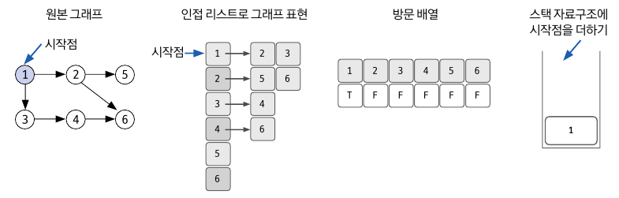
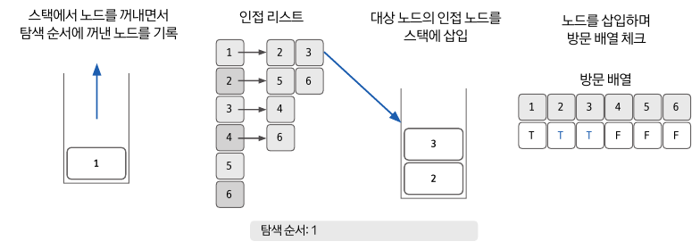
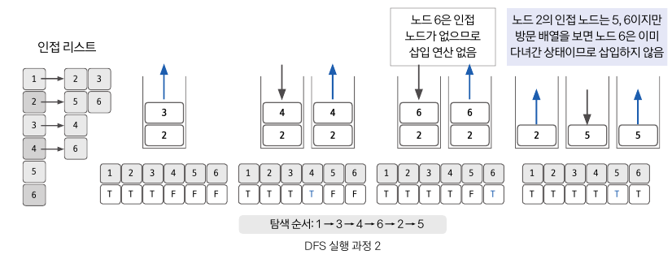

## 깊이 우선 탐색, DFS(Depth-First Search)이란?

---

DFS는 탐색할 분기를 정해서 최대 깊이까지 탐색 후, 다른 분기로 이동하여 다시 탐색을 수행하는 알고리즘이다.

- DFS는 재귀함수 또는 스택 자료구조를 이용하여 구현한다.
- 재귀함수를 이용하므로 Stack Overflow에 유의해야 한다.

## 1. DFS 시간 복잡도

---

> **인접 리스트**
>

- 노드의 개수가 많고, 간선의 수가 적을 때 유리하다.

> **인접 행렬**
>

- 노드의 개수가 적고, 간선의 수가 많을 때 유리하다.

|           | 인접 리스트                  | 인접 행렬  |
|-----------|-------------------------|--------|
| 특정 간선 검색  | O(degree(N)): 해당 노드의 차수 | O(1)   |
| 정점의 차수 계산 | O(degree(N))            | O(N)   |
| 전체 노드 탐색  | O(E)                    | O(N^2) |
| 메모리       | N + E                   | N^2    |

**(노드 수: N, 에지 수: E)**

## 2. DFS 핵심 이론

---

### 1) 방문 여부 확인용 배열

| 1 | 2 | 3 | 4 | 5 | 6 |
|---|---|---|---|---|---|
| T | F | F | F | F | F |

DFS는 한 번 방문한 노드를 다시 방문하면 안되므로 노드 방문 여부를 체크할 배열이 필요하다.

- 해당 부분이 제대로 구현되지 않으면, 재귀함수로 인해 무한루프에 빠질 수 있음을 유의해야 한다.

예를 들어, 1~6의 노드를 가진 그래프가 있다고 가정하면,

- *boolean[] visited = new boolean[7];* 으로 배열을 만들어 준다.
- 해당 노드를 방문하면 해당 인덱스 값을 ***TRUE***로 바꿔준다.

### 2) 원본 그래프 → 자료구조 초기화(인접 리스트)

1. 시작할 노드를 정한다.
2. 각 노드에서 갈 수 있는 다른 노드를 확인 후 인접 리스트로 초기화한다.
3. 시작점을 정했으므로 시작점의 방문 배열을 ***TRUE***로 바꿔주고, 스택에 시작점을 더한다.

### 3) 스택(재귀함수)에서 꺼낸 노드의 인접 노드를 스택에 삽입

1. 맨 처음에 넣었던 시작 노드인 1번 노드를 스택에서 *pop( )*한다.
    1. *pop( )* 할 때, 해당 값의 방문 배열은 ***TRUE***로 바꿔준다.
2. 1번 노드의 인접 노드인 2번 노드와 3번 노드를 스택에 삽입한다.
3. 해당 과정을 스택이 비워질 때까지 반복한다.

### 4) 반복

예를 들어, 1번 노드가 *pop( )*되고, 2번 노드와 3번 노드가 스택에 들어있는 상황을 가정하자.

1. *pop(3)* → 3번 노드의 방문 배열을 ***TRUE***로 변경한다. → 3번 노드의 인접 노드를 *push(4)*
2. *pop(4)* → 4번 노드의 방문 배열을 ***TRUE***로 변경한다. → 4번 노드의 인접 노드를 *push(6)*
3. *pop(6)* → 6번 노드의 방문 배열을 ***TRUE***로 변경한다. → 6번 노드는 인접 노드가 없어 *push( )* 할 수 없다.
4. *pop(2)* → 2번 노드의 인접 노드는 5번과 6번 노드이지만, 6번 노드의 방문 배열은 ***TRUE***이다.
    - → 때문에 *push(5)*만 할 수 있다.
5. *pop(5)* → 5번 노드의 방문 배열을 ***TRUE***로 변경한다.
6. ***stack.isEmpty( ) == true***

결과적으로 탐색 순서는 **[ 1 → 3 → 4 → 6 → 2 → 5 ]** 이다.

## 참고 자료

- [[Algorithm/Java] DFS(깊이 우선 탐색)](https://innovation123.tistory.com/71)
