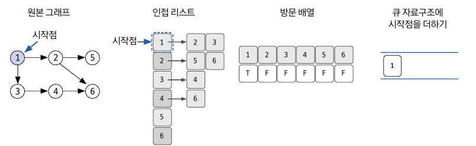
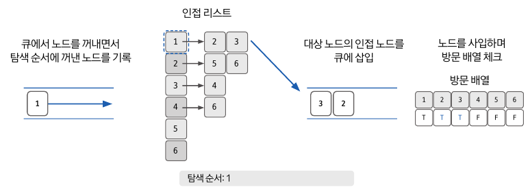
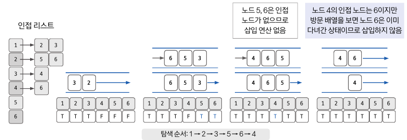

## 너비 우선 탐색, BFS(Breadth-First Search)이란?

---

BFS는 시작 노드에서 출발해 시작 노드를 기준으로 가장 가까운 노드를 먼저 방문하며 탐색하는 알고리즘이다.

- BFS는 그래프 완전 탐색으로 FIFO 탐색을 하며, Queue 자료구조를 이용한다.
- 또한, 목표 노드에 도착하는 경로가 여러 개일 때 최단 경로를 보장한다.

## 1. BFS 시간 복잡도

---

> **인접 리스트**
>
- 노드의 개수가 많고, 간선의 수가 적을 때 유리하다.

> **인접 행렬**
>
- 노드의 개수가 적고, 간선의 수가 많을 때 유리하다.

|  | 인접 리스트 | 인접 행렬 |
| --- | --- | --- |
| 특정 간선 검색 | O(degree(N)): 해당 노드의 차수 | O(1) |
| 정점의 차수 계산 | O(degree(N)) | O(N) |
| 전체 노드 탐색 | O(E) | O(N^2) |
| 메모리 | N + E | N^2 |

## BFS 핵심 이론

---

### 1) 방문 여부 확인용 배열

BFS도 DFS와 마찬가지로 한 번 방문한 노드를 다시 방문하면 안되므로 방문 여부를 확인할 배열이 필요하다.

예를 들어, 1~6의 노드를 가진 그래프가 있다면, *boolean[] visited = new boolean[7];* 으로 초기화한다.

- 해당 노드를 방문하면 해당 인덱스 값을 ***TRUE***로 바꿔준다.

### 2) 원본 그래프 → 자료구조 초기화 (인접 리스트)

1. 시작할 노드를 정한다.
2. 각 노드에서 갈 수 있는 다른 노드를 확인 후 인접 리스트로 초기화한다.
3. 시작점을 정했기 때문에 시작점의 방문 배열을 ***TRUE***로 바꿔주고, *Queue*에 시작점을 더한다.

### 3) Queue에서 꺼낸 노드의 인접 노드를 Queue에 삽입

1. 맨 처음에 넣었던 1번 노드를 큐에서 꺼낸다.
2. 꺼낸 1번 노드의 인접 노드인 2번 노드와 3번 노드를 큐에 삽입한다.
3. 해당 과정을 큐가 비워질 때까지 반복한다.

### 4) 반복

예를 들어, 1번 노드를 꺼낸 뒤 2번 노드와 3번 노드를 넣었다고 가정하자.

1. *poll(2)* → 2번 노드의 방문 배열을 ***TRUE***로 변경한다. → 2번 노드의 인접 리스트에 *offer(5), offer(6)*
2. *poll(3)* → 3번 노드의 방문 배열을 ***TRUE***로 변경한다. → 3번 노드의 인접 리스트에 *offer(4)*
3. *poll(5)* → 5번 노드의 방문 배열을 ***TRUE***로 변경한다. → 5번 노드의 인접 리스트는 없다.
4. *poll(6)* → 6번 노드의 방문 배열을 ***TRUE***로 변경한다. → 6번 노드의 인접 리스트는 없다.
5. *poll(4)* → 4번 노드의 방문 배열을 ***TRUE***로 변경한다. → 4번 노드의 인접 리스트는 없다.
6. ***queue.isEmpty( ) == true***

결과적으로 탐색 순서는 **[ 1 → 2 → 3 → 5 → 6 → 4 ]** 이다.

## 참고 자료

- [[Algorithm/Java] BFS(너비 우선 탐색)](https://innovation123.tistory.com/72?category=1127081)
